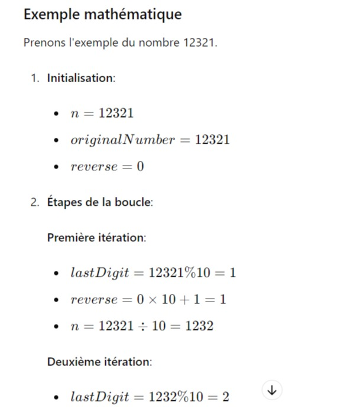
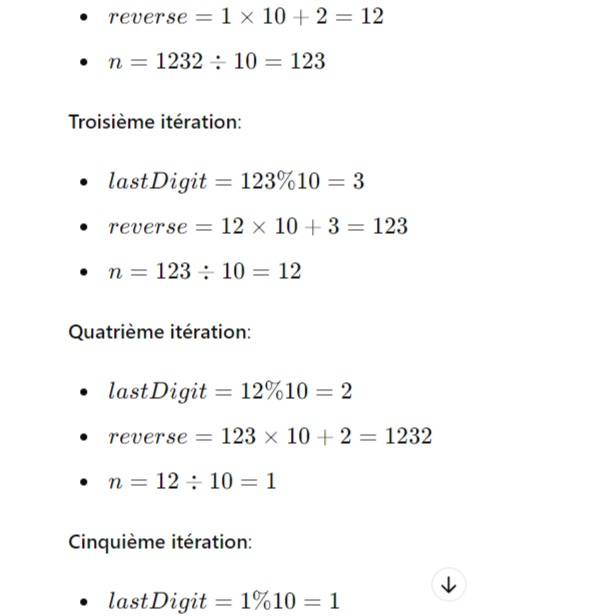
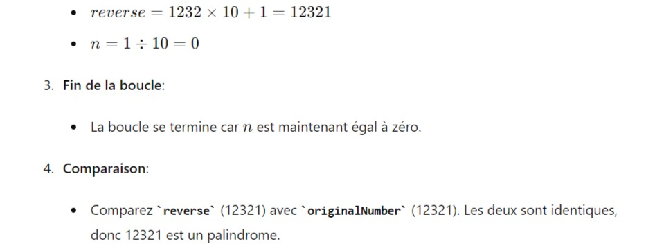

# Palindrome des nombres

+ Écrivez une méthode appelée isPalindrome avec un paramètre int appelé number.

+ La méthode doit renvoyer un booléen.

+ Il doit renvoyer vrai si le nombre est un nombre palindrome, sinon il doit renvoyer faux.

+ Consultez les conseils ci-dessous pour plus d’informations sur les palindromes.

**Exemple d'entrée/sortie**

```
isPalindrome(-1221); → devrait retourner vrai

isPalindrome(707); → devrait retourner vrai

isPalindrome(11212); → devrait renvoyer false car reverse est 21211 et ce n'est pas égal à 11212.
```


**Astuce** : Qu'est-ce qu'un numéro Palindrome ? Un nombre palindrome est un nombre qui, une fois inversé, est égal au nombre d'origine. Par exemple : 121, 12321, 1001 etc.

**Astuce** : Logique pour vérifier un numéro palindrome

+ Trouvez l’inverse du nombre donné. Stockez-le dans une variable, par exemple inverse. Comparez le nombre avec l'inverse.

+ Si les deux sont identiques, alors le nombre est un palindrome, sinon il ne l’est pas.

**Astuce** : Logique pour inverser un nombre

+ Déclarez et initialisez une autre variable pour stocker l'inverse d'un nombre, par exemple reverse = 0.

+ Extrayez le dernier chiffre du nombre donné en effectuant la division modulo (reste).
+ Stockez le dernier chiffre dans une variable, par exemple lastDigit = num % 10.
+ Augmentez la valeur de position de reverse de un.
+ Pour augmenter la valeur de position, multipliez la variable inverse par 10, par exemple. inverse = inverse * 10.
+ Ajoutez lastDigit pour inverser.
+ Puisque le dernier chiffre du numéro est traité, supprimez le dernier chiffre de num. Pour supprimer le dernier chiffre, divisez le nombre par 10.
+ Répétez les étapes jusqu'à ce que le nombre ne soit pas égal (ou supérieur) à zéro.

+ Une boucle while serait utile pour cet exercice de codage.


**Astuce** : Soyez prudent avec les nombres négatifs. Il peut également s'agir de nombres palindromes.

**Astuce** : Soyez prudent lorsque vous inversez un nombre, vous aurez besoin d'un paramètre pour comparer un nombre inversé avec le nombre de départ (paramètre).


**REMARQUE** : La méthode isPalindrome doit être définie comme public statique comme nous l'avons fait.


# Détail Mathématiques 




